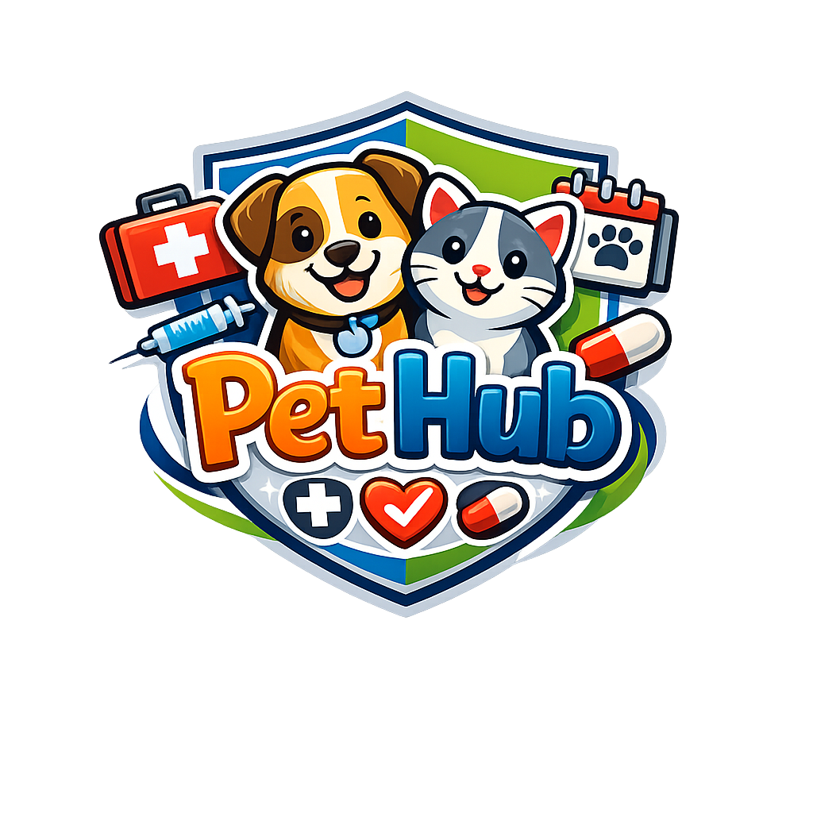

<div align="center">
  
</div>

# 🐾 PetHub — Backend

PetHub é uma aplicação desenvolvida para donos de pets que querem centralizar e acompanhar a saúde dos seus animais em um só lugar. 
Com o PetHub, é possível cadastrar múltiplos pets e manter um histórico completo de vacinas, consultas veterinárias e medicamentos de cada um.

O sistema conta com autenticação segura via JWT, garantindo que cada usuário acesse apenas os dados dos seus próprios pets. 
Na hora de cadastrar um pet, a aplicação consulta automaticamente a [The Dog API](https://thedogapi.com) ou a [The Cat API](https://thecatapi.com) 
para sugerir raças com base na espécie selecionada.

## Funcionalidades

- Cadastro e autenticação de usuários com JWT (RSA 2048 bits)
- Gerenciamento completo de pets (cachorro, gato ou outros)
- Sugestão automática de raças via integração com Dog API e Cat API
- Registro de vacinas com controle de próxima dose
- Histórico de consultas veterinárias com registro de peso
- Controle de medicamentos com período de tratamento
- Isolamento de dados por usuário — cada dono vê apenas seus pets
## Tecnologias

- **Java 17** + **Spring Boot 4**
- **Spring Security** com JWT (RSA)
- **Spring Data JPA** + **PostgreSQL**
- **Flyway** para migrations
- **Http Exchange** para integração com Dog API e Cat API
- **Docker** + **Docker Compose**
- **Lombok**
- **Gradle**

---

## Pré-requisitos

- Java 17+
- Docker Desktop
- OpenSSL (para gerar as chaves RSA)

---

## Configuração

### 1. Clone o repositório

```bash
git clone https://github.com/seu-usuario/pethub.git
cd pethub
```

### 2. Gere as chaves RSA

As chaves não são versionadas por segurança. Crie a pasta e gere os arquivos:

```bash
mkdir -p src/main/resources/certs

openssl genrsa -out src/main/resources/certs/private_key.pem 2048

openssl rsa -in src/main/resources/certs/private_key.pem -pubout -out src/main/resources/certs/public_key.pem
```

### 3. Suba o banco de dados

```bash
docker-compose up -d
```

### 4. Configure as API Keys

No `src/main/resources/application.properties`, adicione suas chaves das APIs externas no `HttpExchangeConfig.java`:

- **The Dog API** → [thedogapi.com](https://thedogapi.com) (gratuito)
- **The Cat API** → [thecatapi.com](https://thecatapi.com) (gratuito)

```java
.defaultHeader("x-api-key", "SUA_API_KEY_AQUI")
```

### 5. Execute o projeto

```bash
./gradlew bootRun
```

O Flyway vai criar as tabelas automaticamente na primeira execução.

---

## Endpoints

### Autenticação

| Método | Endpoint | Descrição | Auth |
|---|---|---|---|
| POST | `/users` | Cadastrar usuário | ❌ |
| POST | `/login` | Login e geração de token | ❌ |

### Pets

| Método | Endpoint | Descrição | Auth |
|---|---|---|---|
| GET | `/pets` | Listar pets do usuário logado | ✅ |
| POST | `/pets` | Cadastrar pet | ✅ |
| GET | `/pets/{id}` | Buscar pet por ID | ✅ |
| PUT | `/pets/{id}` | Atualizar pet | ✅ |
| DELETE | `/pets/{id}` | Deletar pet | ✅ |

### Vacinas

| Método | Endpoint | Descrição | Auth |
|---|---|---|---|
| GET | `/pets/{petId}/vacinas` | Listar vacinas do pet | ✅ |
| POST | `/pets/{petId}/vacinas` | Cadastrar vacina | ✅ |
| PUT | `/pets/{petId}/vacinas/{id}` | Atualizar vacina | ✅ |
| DELETE | `/pets/{petId}/vacinas/{id}` | Deletar vacina | ✅ |

### Consultas

| Método | Endpoint | Descrição | Auth |
|---|---|---|---|
| GET | `/pets/{petId}/consultas` | Listar consultas do pet | ✅ |
| POST | `/pets/{petId}/consultas` | Cadastrar consulta | ✅ |
| PUT | `/pets/{petId}/consultas/{id}` | Atualizar consulta | ✅ |
| DELETE | `/pets/{petId}/consultas/{id}` | Deletar consulta | ✅ |

### Medicamentos

| Método | Endpoint | Descrição | Auth |
|---|---|---|---|
| GET | `/pets/{petId}/medicamentos` | Listar medicamentos do pet | ✅ |
| POST | `/pets/{petId}/medicamentos` | Cadastrar medicamento | ✅ |
| PUT | `/pets/{petId}/medicamentos/{id}` | Atualizar medicamento | ✅ |
| DELETE | `/pets/{petId}/medicamentos/{id}` | Deletar medicamento | ✅ |

### Raças (Http Exchange)

| Método | Endpoint | Descrição | Auth |
|---|---|---|---|
| GET | `/racas/search?q={termo}&especie={CACHORRO\|GATO}` | Buscar raças na Dog/Cat API | ✅ |

---

## Autenticação

A API usa **JWT com chaves RSA**. Para acessar os endpoints protegidos:

1. Cadastre um usuário em `POST /users`
2. Faça login em `POST /login` e copie o token retornado
3. Adicione o header em todas as requisições:

```
Authorization: Bearer {token}
```

---

## Estrutura do Projeto

```
src/main/java/br/com/fiap/pethub/
├── client/         ← Http Exchange (Dog API e Cat API)
├── config/         ← Configuração do Http Exchange
├── controller/     ← Endpoints REST
├── entity/         ← Entidades JPA
├── repository/     ← Repositories
├── security/       ← JWT, Security Config
└── service/        ← Regras de negócio
```

---

## Banco de Dados

As migrations são gerenciadas pelo **Flyway** e executadas automaticamente ao iniciar a aplicação.

```
V1 → users
V2 → pets
V3 → vacinas
V4 → consultas
V5 → medicamentos
```

---

## Segurança

- Senhas armazenadas com **BCrypt**
- Tokens JWT assinados com **RSA 2048 bits**
- Cada usuário acessa apenas os próprios pets e registros
- Chaves RSA não versionadas (`.gitignore`)

---

## Sobre o projeto

PetHub foi desenvolvido com foco em boas práticas de desenvolvimento back-end, incluindo separação de responsabilidades em camadas (controller, service, repository), 
autenticação stateless com JWT assinado por chaves RSA, versionamento de banco de dados com Flyway e integração com APIs externas via Http Exchange. 
O projeto segue padrões REST e está containerizado com Docker para facilitar a execução em qualquer ambiente.
